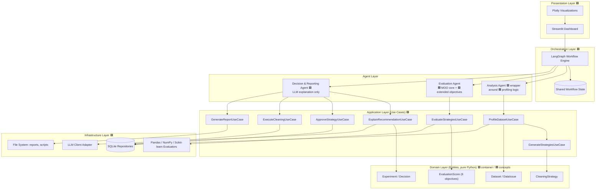
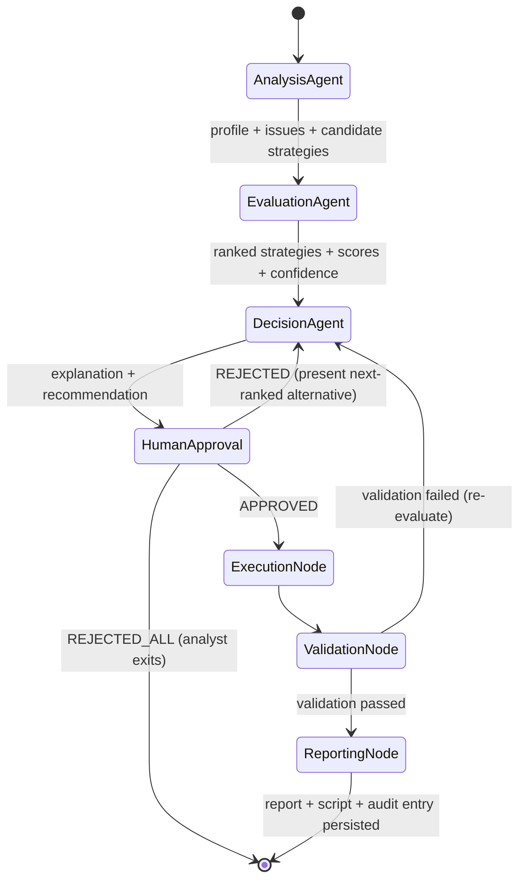
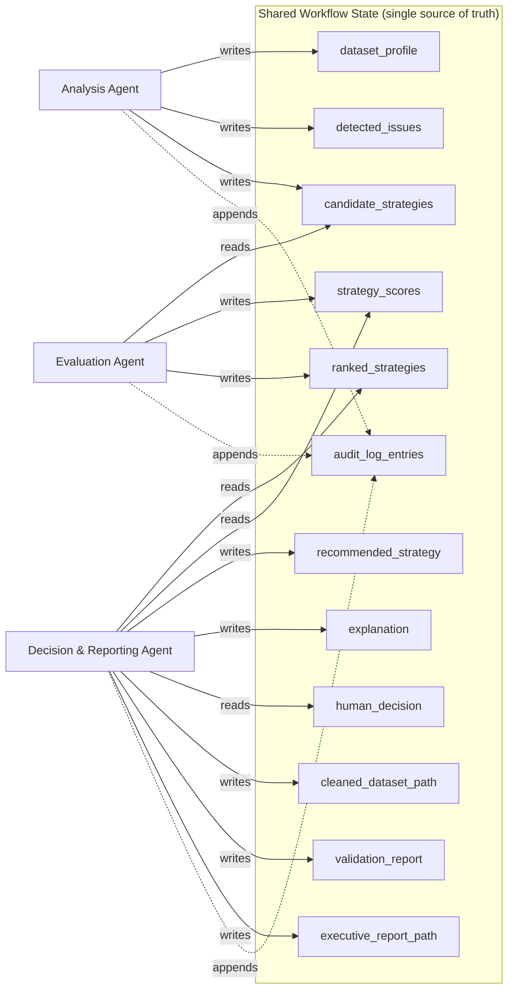
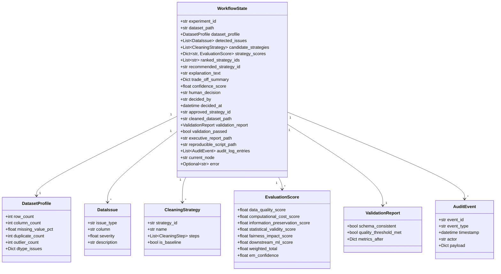
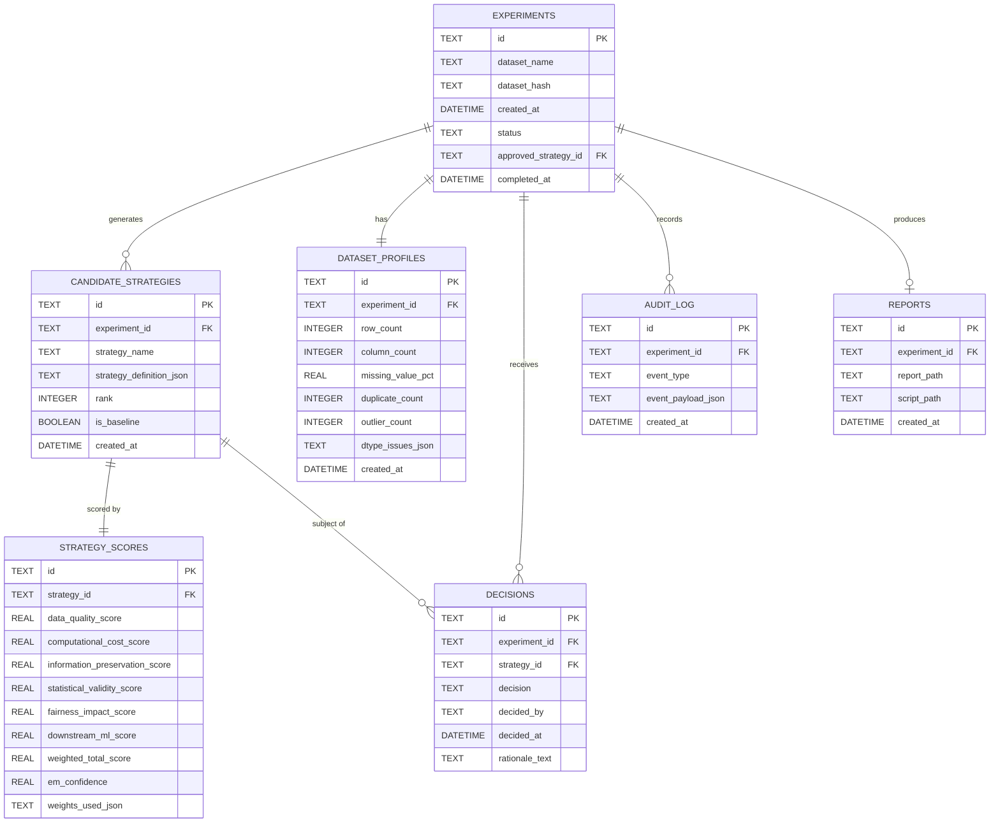
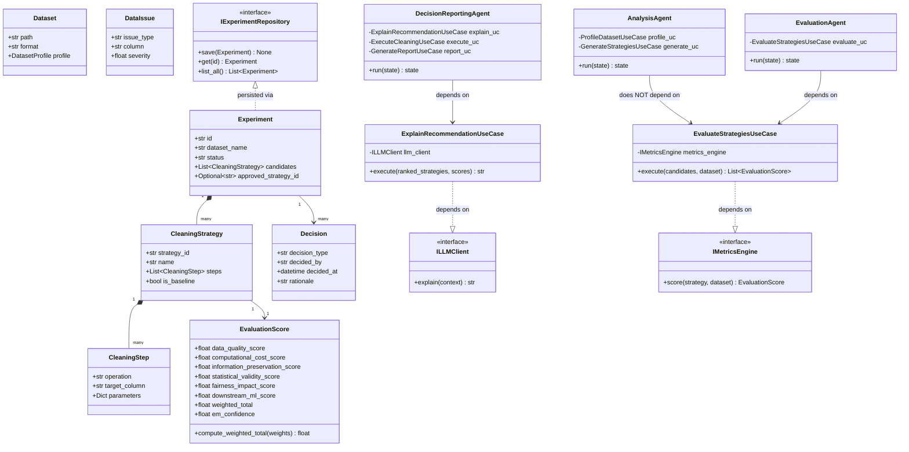
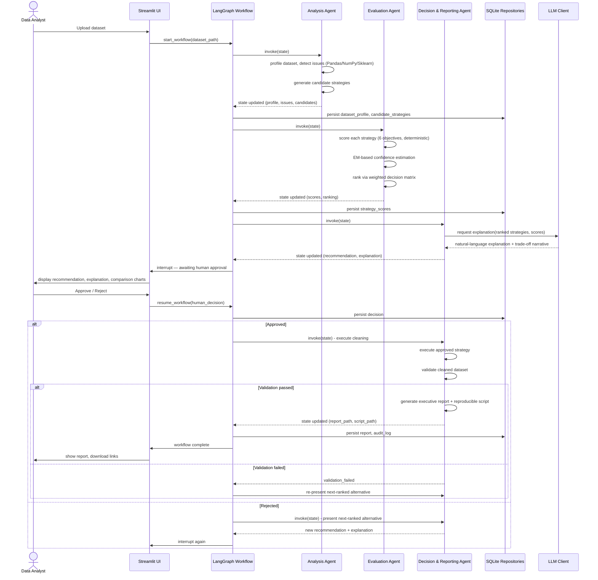
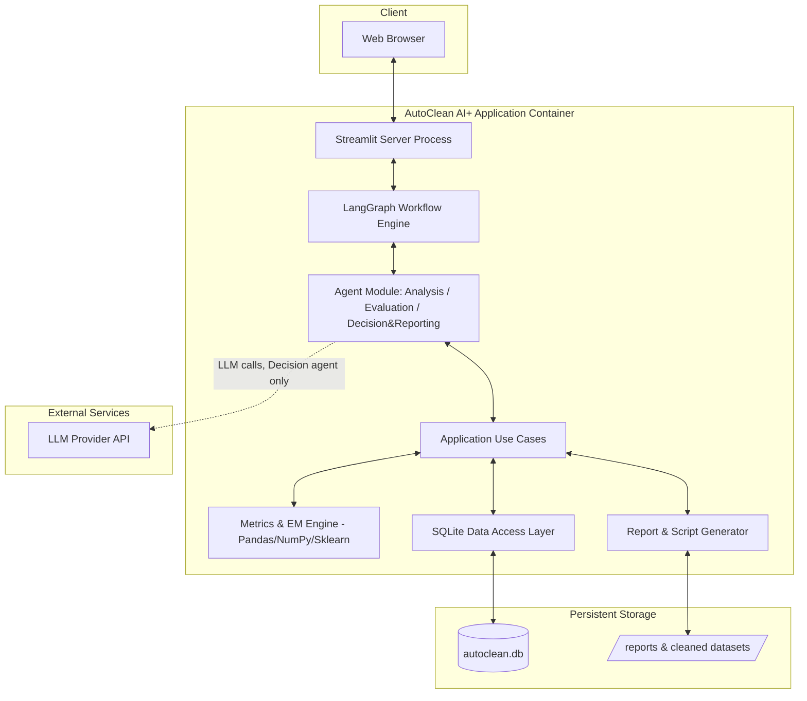
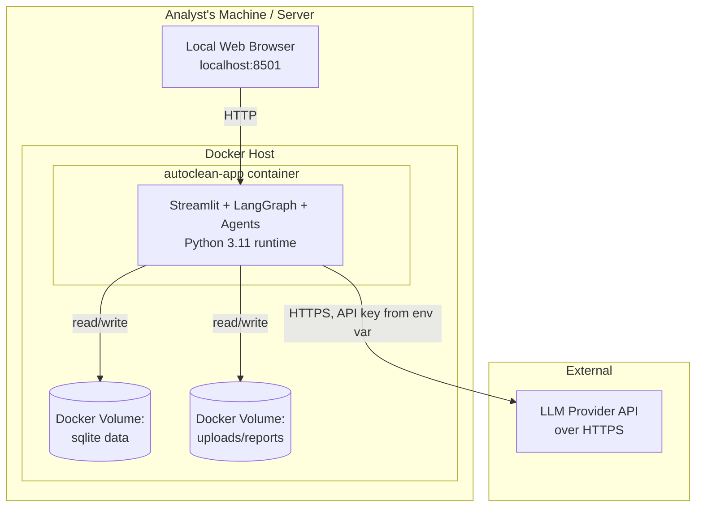

# AutoClean AI+: Phase 2 — System Design

**Project:** AutoClean AI+: A Multi-Agent Explainable Decision Support System for Multi-Objective Data Cleaning Strategy Optimization
**Phase:** 2 of 12 — System Design
**Status:** Draft for approval
**Depends on:** Phase 1 — Research & Requirements (approved)

No source code is written in this phase. This document specifies architecture, structure, data contracts, and diagrams only, per the project specification's phase-gating rule.

Tagging convention carried forward from Phase 1: 🟦 **[PAPER]** = derived from Hu et al. (2026); 🟩 **[ORIGINAL]** = introduced by AutoClean AI+.

---

## 1. Overall Architecture

### Theory
A decision-support system that must be simultaneously (a) numerically rigorous, (b) explainable, and (c) safely human-gated needs an architecture that keeps those three concerns in separate, independently verifiable layers rather than one intertwined script. The two dominant architectural patterns for this are **layered/Clean Architecture** (isolate domain logic from frameworks and I/O) and **event-driven/agent orchestration** (isolate the *sequence of work* from the *implementation of each step*). AutoClean AI+ needs both simultaneously: Clean Architecture governs *how a single agent's internals are structured*, and LangGraph governs *how agents hand work to each other*.

### High-Level Architecture Diagram



### Design Decisions
- Presentation, Orchestration, Application/Domain, and Infrastructure are four distinct layers. Agents sit *between* Orchestration and Application — an agent is a thin LangGraph node that calls one or more use cases; it contains no business logic itself.
- The **Evaluation Agent never calls the LLM client**; only the Decision & Reporting Agent has an LLM dependency. This is enforced at the dependency-injection level (Evaluation Agent's constructor has no `LLMClient` parameter at all), not just by convention — architecturally impossible to violate the "LLM never computes" rule, not merely discouraged 🟩[ORIGINAL, enforcing a 🟦[PAPER]-motivated constraint].

### Alternatives Considered
- **Monolithic Streamlit script calling functions directly** (no agent/orchestration layer): rejected — cannot produce an inspectable audit trail (FR-13) or a clean LangGraph state handoff, and mixes UI with business logic, violating NFR-2.
- **Microservices per agent (separate deployable services with REST calls between them)**: rejected as over-engineered for a single-user, single-machine final-year deployment (see Phase 1 §8 Out of Scope: no multi-tenant deployment); adds network failure modes with no benefit at this scale.
- **In-process function pipeline without LangGraph** (plain Python call chain): rejected — loses LangGraph's built-in state persistence/checkpointing, which is what makes the human-in-the-loop interrupt (FR-9) and audit trail (FR-13) straightforward rather than hand-rolled.

### Justification
LangGraph natively supports **interrupt-before/interrupt-after** semantics on a node, which is the exact mechanism needed to pause the workflow for human approval (FR-9) and resume it with the human's decision injected into shared state — this single framework feature is why LangGraph was chosen over a plain function pipeline, and it is a decisive, evidence-based justification rather than a stylistic preference.

---

## 2. Clean Architecture Layers

### Theory
Clean Architecture (Martin) arranges code in concentric layers where dependencies point **inward only**: outer layers (frameworks, UI, DB) may depend on inner layers (domain), but never the reverse. The innermost layer (Entities) has zero knowledge of Streamlit, LangGraph, SQLite, or any LLM SDK.

### Layer Diagram

```mermaid
graph TD
    subgraph L4["Layer 4: Frameworks & Drivers (outermost)"]
        A1[Streamlit UI]
        A2[SQLite via sqlite3 / SQLAlchemy]
        A3[LangGraph Runtime]
        A4[LLM SDK - Anthropic/OpenAI-compatible]
        A5[Pandas / NumPy / Scikit-learn / Plotly]
    end
    subgraph L3["Layer 3: Interface Adapters"]
        B1[Repository Implementations - SQLiteExperimentRepository, etc.]
        B2[LLM Client Adapter - LLMExplainerAdapter]
        B3[Agent Nodes - AnalysisAgentNode, EvaluationAgentNode, DecisionAgentNode]
        B4[Streamlit View Models / Presenters]
    end
    subgraph L2["Layer 2: Application - Use Cases"]
        C1[ProfileDatasetUseCase]
        C2[GenerateStrategiesUseCase]
        C3[EvaluateStrategiesUseCase]
        C4[ExplainRecommendationUseCase]
        C5[ApproveStrategyUseCase]
        C6[ExecuteCleaningUseCase]
        C7[ValidateCleanedDatasetUseCase]
        C8[GenerateReportUseCase]
        C9["Repository / LLM Port Interfaces (ABCs)"]
    end
    subgraph L1["Layer 1: Domain - Entities (innermost)"]
        D1[Dataset]
        D2[DataIssue]
        D3[CleaningStrategy]
        D4[EvaluationScore]
        D5[Experiment]
        D6[Decision]
        D7[AuditEvent]
    end

    L4 --> L3 --> L2 --> L1
```



### Layer Responsibilities

| Layer | Contains | Depends On | Contains 🟦/🟩 |
|---|---|---|---|
| Domain (Entities) | `Dataset`, `DataIssue`, `CleaningStrategy`, `EvaluationScore` (6-objective value object), `Experiment`, `Decision`, `AuditEvent` — plain dataclasses, no I/O | Nothing (pure Python + typing) | `EvaluationScore`'s quality/cost fields are 🟦-motivated concepts; the other 4 objective fields and all workflow entities are 🟩 |
| Application (Use Cases) | One class per functional requirement (FR-1 through FR-15 map ~1:1 to use cases); port interfaces (`IExperimentRepository`, `ILLMClient`, `IDatasetRepository`) as ABCs | Domain only | 🟩 orchestration wrapping 🟦 evaluation logic |
| Interface Adapters | Repository implementations (SQLite), LLM adapter, LangGraph agent node wrappers, Streamlit presenters/view-models | Application (implements its ports) + Domain | 🟩 |
| Frameworks & Drivers | Streamlit, LangGraph runtime, sqlite3, LLM SDK, Pandas/NumPy/Scikit-learn/Plotly | Everything (outermost) | 🟩 orchestration of 🟦-inspired and 🟩 metrics libraries |

### Design Decisions
- **Ports as ABCs**, implemented by Infrastructure, injected into Use Cases via constructor — this is the Dependency Inversion Principle (the "D" in SOLID) applied concretely: `EvaluateStrategiesUseCase` depends on `IMetricsEngine`, not on `sklearn` directly, so the metrics engine can be swapped/mocked in tests without touching business logic.
- Each of the three agents (Analysis, Evaluation, Decision & Reporting) is an **Interface Adapter**, not a Use Case — an agent's job is to translate LangGraph state into use-case calls and translate use-case results back into LangGraph state. Agents contain no scoring math, no SQL, no prompt text.

### Alternatives Considered
- **Two-layer split** (just "business logic" + "everything else"): rejected — insufficiently granular to isolate the LLM boundary (NFR-1) or to unit-test the evaluation engine in total isolation from Streamlit/SQLite (NFR-7).
- **Putting repository interfaces in the Infrastructure layer** (common shortcut in smaller projects): rejected — this is the classic Clean Architecture violation where Application ends up importing Infrastructure; ports belong in Application so Infrastructure depends inward, never the reverse.

### Justification
This four-layer split is the minimum granularity that lets Phase 10 (Testing) unit-test the Evaluation Agent's scoring logic (NFR-7) with zero Streamlit, zero SQLite, and zero live LLM calls — a hard, checkable Phase-10 acceptance criterion that a flatter architecture could not satisfy cleanly.

---

## 3. Folder Structure

### Design Decisions
The folder structure mirrors the Clean Architecture layers 1:1, with agents living alongside the orchestration graph they plug into, and configuration fully externalized (NFR-6).

```
autoclean-ai-plus/
├── src/
│   └── autoclean/
│       ├── domain/                        # Layer 1 — Entities (pure Python, no deps)
│       │   ├── entities/
│       │   │   ├── dataset.py
│       │   │   ├── data_issue.py
│       │   │   ├── cleaning_strategy.py
│       │   │   ├── evaluation_score.py
│       │   │   ├── experiment.py
│       │   │   ├── decision.py
│       │   │   └── audit_event.py
│       │   └── value_objects/
│       │       └── objective_weights.py
│       │
│       ├── application/                   # Layer 2 — Use Cases + Ports
│       │   ├── ports/
│       │   │   ├── experiment_repository.py      # IExperimentRepository (ABC)
│       │   │   ├── dataset_repository.py
│       │   │   ├── llm_client.py                  # ILLMClient (ABC)
│       │   │   └── metrics_engine.py              # IMetricsEngine (ABC)
│       │   └── use_cases/
│       │       ├── profile_dataset.py
│       │       ├── generate_strategies.py
│       │       ├── evaluate_strategies.py
│       │       ├── explain_recommendation.py
│       │       ├── approve_strategy.py
│       │       ├── execute_cleaning.py
│       │       ├── validate_cleaned_dataset.py
│       │       └── generate_report.py
│       │
│       ├── infrastructure/                 # Layer 3/4 — Adapters + Frameworks
│       │   ├── persistence/
│       │   │   ├── sqlite/
│       │   │   │   ├── schema.sql
│       │   │   │   ├── db_session.py
│       │   │   │   ├── experiment_repository_impl.py
│       │   │   │   ├── strategy_repository_impl.py
│       │   │   │   └── audit_repository_impl.py
│       │   ├── llm/
│       │   │   └── llm_client_impl.py             # wraps Anthropic/OpenAI-compatible SDK
│       │   ├── metrics/
│       │   │   ├── quality_metrics.py             # 🟦-motivated
│       │   │   ├── cost_metrics.py                # 🟦-motivated
│       │   │   ├── information_preservation.py    # 🟩
│       │   │   ├── statistical_validity.py        # 🟩
│       │   │   ├── fairness_metrics.py            # 🟩
│       │   │   ├── downstream_ml_metrics.py       # 🟩
│       │   │   └── em_quality_estimator.py        # 🟦 EM algorithm
│       │   └── reporting/
│       │       ├── report_generator.py
│       │       └── script_exporter.py
│       │
│       ├── agents/                         # Interface Adapters wrapping use cases for LangGraph
│       │   ├── analysis_agent.py
│       │   ├── evaluation_agent.py
│       │   └── decision_reporting_agent.py
│       │
│       ├── orchestration/                  # LangGraph workflow definition
│       │   ├── workflow_state.py           # shared TypedDict/Pydantic state schema
│       │   ├── graph_builder.py            # node/edge wiring, interrupts
│       │   └── nodes/
│       │       ├── human_approval_node.py
│       │       └── validation_node.py
│       │
│       ├── presentation/                   # Streamlit UI
│       │   ├── streamlit_app.py
│       │   ├── pages/
│       │   │   ├── 1_upload_and_profile.py
│       │   │   ├── 2_compare_strategies.py
│       │   │   ├── 3_review_and_approve.py
│       │   │   └── 4_experiment_history.py
│       │   └── components/
│       │       ├── strategy_comparison_chart.py
│       │       └── explanation_panel.py
│       │
│       └── config/
│           ├── settings.py                 # env-var driven config (pydantic-settings)
│           └── objective_weights.yaml       # default weighted-decision-matrix weights
│
├── tests/
│   ├── unit/
│   │   ├── domain/
│   │   ├── application/
│   │   └── infrastructure/
│   ├── integration/
│   └── fixtures/
│       └── sample_datasets/
│
├── scripts/
│   └── run_workflow_cli.py                 # non-UI entry point for reproducibility
│
├── docs/
│   ├── phase_deliverables/                 # Phase 1, Phase 2, ... documents
│   └── diagrams/
│
├── data/
│   ├── uploads/
│   └── cleaned/
│
├── PROJECT_MEMORY.md
├── CHANGELOG.md
├── PROJECT_SPECIFICATION.md
├── requirements.txt / pyproject.toml
├── Dockerfile
├── docker-compose.yml
├── .env.example
└── README.md
```

### Alternatives Considered
- **Flat `src/` with no layer subfolders** (common in small scripts): rejected — cannot enforce or visually audit the dependency-inversion rule that Clean Architecture requires.
- **Splitting each agent into its own top-level package** (`analysis_agent/`, `evaluation_agent/`, ...) instead of grouping them under `agents/`: rejected — agents are thin adapters, not independent subsystems; grouping them keeps the LangGraph wiring easy to review in one place.

### Justification
This structure is directly navigable against the Phase 1 requirements table: every `use_cases/*.py` file name can be matched to an FR-ID, and every `metrics/*.py` file is pre-labeled 🟦 or 🟩 in its own docstring — this traceability was a Phase 1 success criterion (§18.1) and the folder structure is designed to make it checkable by directory listing alone.

---

## 4. LangGraph Workflow

### Theory
LangGraph models a workflow as a graph of nodes over a shared, typed state, with support for conditional edges and **interrupts** (pausing execution until an external actor — here, the human analyst — supplies input). This maps directly onto FR-8/FR-9 (present recommendation → require human approval before execution).

### Workflow Diagram



### Node Responsibilities

| Node | Type | Reads from State | Writes to State | 🟦/🟩 |
|---|---|---|---|---|
| `AnalysisAgent` | Agent | `dataset_path` | `dataset_profile`, `detected_issues`, `candidate_strategies` | 🟩 wrapper / 🟦-motivated profiling |
| `EvaluationAgent` | Agent | `candidate_strategies` | `strategy_scores`, `ranked_strategies`, `confidence_scores` | 🟦 core MOO + EM / 🟩 extended objectives |
| `DecisionAgent` | Agent | `ranked_strategies`, `strategy_scores` | `recommended_strategy`, `explanation`, `trade_off_summary` | 🟩 |
| `HumanApproval` | Interrupt node | `recommended_strategy`, `explanation` | `human_decision`, `decided_by`, `decided_at` | 🟩 |
| `ExecutionNode` | Deterministic node | `approved_strategy` | `cleaned_dataset_path` | 🟩 orchestration of 🟦-informed strategy |
| `ValidationNode` | Deterministic node | `cleaned_dataset_path` | `validation_report`, `validation_passed` | 🟩 |
| `ReportingNode` | Agent-assisted node | full state | `executive_report_path`, `reproducible_script_path`, `audit_trail_id` | 🟩 |

### Design Decisions
- `HumanApproval` is implemented as a LangGraph **interrupt-before** node: the graph halts, persists its checkpoint, and returns control to the Streamlit layer, which resumes the graph with the analyst's decision once submitted. This is what makes FR-9 ("shall not execute... without explicit human approval") an architectural guarantee rather than a UI convention that could be bypassed by calling a different code path.
- Rejection loops back to `DecisionAgent`, not to `EvaluationAgent` — re-scoring is not needed to present the next-ranked alternative, since the Evaluation Agent already scored and ranked all candidates in one pass. This avoids redundant computation.
- Validation failure loops back to `DecisionAgent` (not straight to `ExecutionNode` retry) so that a failed validation is explained to the analyst like any other decision point, keeping the "always explain, always confirm" principle uniform across the graph.

### Alternatives Considered
- **Polling instead of interrupt** (background job checks a DB flag for approval): rejected — LangGraph's native interrupt/checkpoint mechanism is simpler, avoids race conditions, and keeps the audit trail's timestamps accurate to the actual approval event rather than to the next poll tick.
- **Looping rejection back to `AnalysisAgent`** (full restart): rejected — wasteful; the issue profile and candidate strategy set do not change just because the analyst rejected one ranked option.

### Justification
This graph shape is the smallest state machine that satisfies every functional requirement from Phase 1 §11 (FR-3 through FR-13) while keeping exactly one human-decision point in the entire workflow, which simplifies both the audit trail schema (§7) and the Streamlit page flow (§3, `presentation/pages/`).

---

## 5. Agent Communication

### Theory
Agents in this system do not communicate directly with one another (no agent-to-agent function calls or message passing). They communicate **exclusively through the shared workflow state**, mediated by the LangGraph runtime. This is the "blackboard" architectural pattern: each agent reads what it needs from a shared structure and writes its output back to the same structure, without knowing which agent produced or will consume any given field.

### Communication Diagram



### Design Decisions
- No agent has a reference to any other agent's class. An agent's constructor receives only the use cases and ports it needs (Dependency Injection); it never receives, e.g., `EvaluationAgent` as a collaborator.
- Every agent appends a structured entry to `audit_log_entries` on every write, so the audit trail (FR-13) is a natural by-product of normal state mutation rather than a bolt-on logging pass.

### Alternatives Considered
- **Direct method calls between agents** (`EvaluationAgent.evaluate(analysis_agent.get_strategies())`): rejected — creates tight coupling, defeats LangGraph's checkpointing/interrupt model, and makes it impossible to resume a paused workflow from persisted state alone.
- **Pub/sub message queue between agents** (e.g., an internal event bus): rejected as unnecessary complexity for a single-process, single-user application; the LangGraph state object already serves this purpose with less infrastructure.

### Justification
Blackboard-style communication through one shared, serializable state object is exactly what LangGraph checkpoints to disk/memory between interrupts — choosing this pattern is therefore not just theoretically clean but is required to make the human-approval interrupt (§4) actually resumable.

---

## 6. Shared Workflow State

### Theory
The shared state is the contract every agent and node must honor. It is defined once, typed strictly, and is the only channel of information flow in the system (§5).

### Schema (conceptual — implemented as a `TypedDict`/Pydantic model in Phase 5)



### Design Decisions
- `strategy_scores` is a dictionary keyed by `strategy_id`, not a list, so any node can look up a specific strategy's score in O(1) without depending on ordering — ordering is separately captured by `ranked_strategy_ids`.
- `EvaluationScore` has six named float fields (not a generic `Dict[str, float]`) so that the six required objectives (Phase 1 FR-4) are enforced by the type system itself — a missing objective is a type error, not a silently missing dict key.
- `error` is a top-level optional field so any node can short-circuit the graph into a graceful failure path (NFR-5) without raising an unhandled exception through LangGraph's runtime.

### Alternatives Considered
- **A single flat dict (`Dict[str, Any]`) as state**: rejected — defeats static type checking and makes the six-objective contract (NFR-1/FR-4) unenforceable at the type level.
- **Separate state objects per agent, merged at the end**: rejected — reintroduces the coupling problem from §5; a single shared state is what the blackboard pattern requires.

### Justification
A strictly typed, single shared state is the concrete mechanism that turns three abstract requirements — FR-4 (six objectives), FR-13 (audit trail), NFR-5 (graceful errors) — into compiler/type-checker-enforceable guarantees rather than developer discipline alone.

---

## 7. Database Schema (SQLite)

### Theory
The audit trail and experiment history requirements (FR-13, FR-15) require a normalized relational schema so that a strategy's scores, the human decision made about it, and the experiment it belongs to are separately queryable — e.g., "show me every experiment where the analyst rejected the top-ranked recommendation."

### Entity-Relationship Diagram



### Design Decisions
- `strategy_definition_json` and `event_payload_json` store structured JSON blobs inside TEXT columns — SQLite has no native JSON type, and full normalization of every cleaning-step field would over-fragment the schema for a single-user, low-concurrency application. This is a deliberate, bounded use of denormalization.
- `DECISIONS` is separate from `EXPERIMENTS.approved_strategy_id` — an experiment has exactly one *final* approved strategy, but `DECISIONS` records *every* decision event (including rejections of earlier-ranked strategies), which is what makes "show me every rejection" (§7 Theory example) queryable.
- All primary keys are `TEXT` (UUIDs), not auto-increment integers, so that IDs generated in-memory by the Domain layer (before any DB write occurs) remain stable and referenceable across the shared workflow state, the SQLite rows, and the exported report/script filenames.

### Alternatives Considered
- **Single wide `experiments` table with all strategy/score columns flattened**: rejected — cannot represent multiple candidate strategies per experiment, which is required by FR-3 ("at least two candidate strategies").
- **A generic key-value `EAV` (entity-attribute-value) schema** for maximum metric flexibility: rejected — sacrifices query simplicity and type safety for a flexibility this project does not need (the six objectives are fixed by FR-4, not open-ended).
- **PostgreSQL or another server-based RDBMS**: rejected per the fixed technology stack (SQLite, Phase 1 §16 Constraint 3) and because a single-user, single-file database is a better operational fit for demo/deployment simplicity (NFR-8).

### Justification
This schema is the minimum normalization that (a) supports FR-3's multi-strategy requirement, (b) supports FR-15's experiment-history browsing, and (c) keeps every audit-relevant event queryable by experiment — verified against Phase 1's functional requirements table directly, not designed in the abstract.

---

## 8. UML Class Diagram (Domain + Application Layer Contracts)



*(Note: the "does NOT depend on" relation on `AnalysisAgent` is included deliberately, to make the enforced architectural boundary from §1 visually explicit in the diagram itself.)*

---

## 9. Sequence Diagram — Full End-to-End Run



---

## 10. Component Diagram



---

## 11. Deployment Diagram



### Design Decisions
- Single-container deployment (`docker-compose.yml` with one service) — consistent with Phase 1's Out-of-Scope decision against multi-tenant/multi-user deployment.
- SQLite database and uploaded/cleaned files are Docker **volumes**, not baked into the image, so experiment history and the audit trail survive container rebuilds.
- The LLM API key is injected via environment variable (`.env`, NFR-6), never hard-coded or committed to Git.

### Alternatives Considered
- **Separate containers for UI and workflow engine**: rejected — LangGraph and Streamlit run in the same Python process in this design (Streamlit invokes the graph in-process); splitting them would require a network API between them for no architectural benefit at this scale.
- **Bind-mounting the whole project directory instead of named volumes**: rejected for the shipped deployment — named volumes are more portable across host machines; bind mounts remain useful for local development and will be documented separately in Phase 11.

### Justification
This deployment shape is the simplest configuration that still satisfies NFR-8 (containerized/reproducible) and NFR-9 (Git-versioned) while keeping stateful data (DB, files) outside the versioned image, which is standard Docker practice for any application with a persistent audit trail.

---

## 12. Design Patterns Used

| Pattern | Where Used | Why |
|---|---|---|
| **Repository** | `IExperimentRepository`, `IDatasetRepository`, SQLite implementations | Isolates persistence details from use cases (NFR-2); enables in-memory fakes for unit testing (NFR-7) |
| **Dependency Injection** | Every use case and agent constructor | Enforces the architectural LLM boundary (§1) and enables test doubles |
| **Strategy** | `CleaningStrategy` + `CleaningStep` objects passed to `ExecuteCleaningUseCase` | Cleaning strategies are interchangeable algorithm objects evaluated and selected at runtime — a textbook Strategy pattern application, and directly analogous to the paper's own "method" abstraction 🟦 |
| **Factory** | `GenerateStrategiesUseCase` (builds `CleaningStrategy` objects from detected issues) | Centralizes strategy construction logic so new strategy types can be added without touching evaluation or orchestration code |
| **Adapter** | `LLMClientImpl` (wraps a specific LLM SDK behind `ILLMClient`) | Allows the underlying LLM provider to be swapped without touching `ExplainRecommendationUseCase` |
| **Template Method** | Metrics engine base class defining `score()` skeleton with hook methods per objective | Ensures every metric module (`quality_metrics.py`, `fairness_metrics.py`, etc.) follows the same deterministic-input → float-output contract required by NFR-1 |
| **State (workflow state object)** | `WorkflowState` shared across LangGraph nodes | Formalizes the blackboard communication pattern (§5, §6) |
| **Facade** | `graph_builder.py` exposing a single `run_workflow()` / `resume_workflow()` entry point to the Streamlit layer | Hides LangGraph wiring complexity from the Presentation layer |
| **Interrupt / Checkpoint (LangGraph-native)** | `HumanApproval` node | Implements FR-9's mandatory approval gate as a framework-level guarantee, not an application-level check |

---

## 13. Technology Justification

| Technology | Role | Why Chosen | Alternative Considered | Why Rejected |
|---|---|---|---|---|
| **Python** | Primary language | Required by spec; dominant ecosystem for Pandas/NumPy/Sklearn/LangGraph | — | Fixed constraint (Phase 1 §16) |
| **LangGraph** | Agent orchestration | Native interrupt/checkpoint support maps directly onto FR-9; explicit typed shared state maps onto §5/§6 | Plain function pipeline; AutoGen-style conversational agents | Plain pipeline lacks interrupts; conversational-agent frameworks are optimized for open-ended dialogue, not a fixed 3-agent deterministic-then-explain pipeline |
| **Pandas / NumPy** | Deterministic data profiling, cleaning execution, metric computation | Standard, well-tested tabular data tooling; required by NFR-1 (LLM must never compute) | Polars | Polars offers speed but smaller ecosystem/documentation maturity for a final-year academic project; Pandas chosen for reviewer familiarity and library interoperability (Sklearn expects Pandas/NumPy inputs) |
| **Scikit-learn** | Downstream ML impact evaluation, statistical validity, some fairness computations | Mature, well-documented, sufficient for benchmark classifiers/regressors at this project's scale | Deep learning frameworks (PyTorch/TensorFlow) | Unnecessary complexity — downstream ML impact only needs a benchmark model, not deep learning, per Phase 1 §7 objective 6 |
| **SQLite** | Audit trail & experiment history persistence | Zero-configuration, single-file, fixed by spec; fits single-user deployment | PostgreSQL/MySQL | Requires a separate server process — unnecessary operational overhead for a single-user tool (Phase 1 §16 Constraint 3) |
| **Streamlit** | Presentation layer | Fastest path to an interactive Python-native dashboard; fixed by spec | Dash, Flask+React | Dash/Flask+React require substantially more custom front-end code for equivalent interactivity within a final-year timeline |
| **Plotly** | Strategy comparison visualizations | Interactive charts embed natively in Streamlit; fixed by spec | Matplotlib | Matplotlib is static; Plotly's interactivity directly supports FR-14 |
| **Pytest** | Testing | Fixed by spec; industry standard, integrates with coverage tooling for Phase 10 | unittest (stdlib) | Pytest's fixtures/parametrization better support testing the Evaluation Agent across many strategy/dataset combinations |
| **Docker** | Deployment | Fixed by spec; reproducibility (NFR-8) | Manual venv setup | Not reproducible across evaluator machines — a real risk for an academic project that must run on a panel's machine |
| **Git** | Version control | Fixed by spec; NFR-9 | — | Fixed constraint |
| **LLM API (Anthropic/OpenAI-compatible)** | Decision & Reporting Agent's explanation generation only | Needed for natural-language explanation (FR-7); provider-agnostic via the `ILLMClient` port (Adapter pattern, §12) | Local open-source LLM | Left as a configurable option behind `ILLMClient`, not excluded — Phase 3 will finalize which is used by default, per Phase 1's Suggested Improvement #2 |

---

## 14. IEEE Paper Features vs. Original Contributions — Phase 2 Design-Level Mapping

This table extends Phase 1 §9/§10 to the design artifacts produced in this phase specifically.

| Design Artifact | 🟦 PAPER-derived | 🟩 ORIGINAL |
|---|---|---|
| `EvaluationScore.data_quality_score`, `.computational_cost_score` | Directly correspond to the paper's \(Q_u(D_j)\), \(C_u(D_j)\) | — |
| `EvaluationScore.information_preservation_score`, `.statistical_validity_score`, `.fairness_impact_score`, `.downstream_ml_score` | — | Four new objectives beyond the paper's two-objective formulation |
| `em_quality_estimator.py` | Directly implements the paper's E-step/M-step (Eqs. 2–6), adapted from per-sample sub-task confusion matrices to per-strategy confidence estimation | Adaptation of unit of analysis is 🟩 |
| Weighted decision matrix in `EvaluateStrategiesUseCase` | Conceptually descended from the paper's weighted-gain metric \(\Delta_{wg}\) (Eq. 7) | Generalized from a 2-term ratio driving a greedy upgrade decision into an N-objective weighted-sum ranking over a small, human-reviewable strategy set — 🟩 generalization |
| Hybrid greedy+DP optimizer (Eq. 8, `DP(r,b)`) | The paper's core algorithm for *large-scale sub-task/method assignment under a hard USD budget* | **Not directly reused as the primary ranking mechanism** in AutoClean AI+'s design, because the action space here (a handful of whole strategies for one dataset) does not require combinatorial budget-constrained assignment across thousands of sub-tasks; the weighted decision matrix is the appropriate analogue at this scale. The hybrid greedy+DP algorithm remains documented (Phase 1 Appendix A) as the paper's method and will be revisited in Phase 6 as an *optional* strategy-portfolio optimizer if multiple strategies must be composed under a resource constraint, rather than the default ranking mechanism |
| LangGraph 3-agent orchestration | — | Entirely 🟩; no orchestration framework is discussed in the paper |
| Human approval interrupt node | — | Entirely 🟩; directly answers the paper's own stated future-work gap (Phase 1 §5.7) |
| SQLite audit trail schema | — | Entirely 🟩 |
| Streamlit dashboard / component diagram | — | Entirely 🟩 |
| Docker deployment diagram | — | Entirely 🟩 (operational concern, out of scope for the paper) |

**Note on Eq. 8 (DP refinement):** flagging this now, in Phase 2, rather than silently dropping it, is itself part of the traceability discipline this project committed to in Phase 1 — the panel should be able to see *not just what was reused, but what was consciously adapted or deferred, and why*.

---

## 15. Review Checklist

Before proceeding to Phase 3, confirm the following:

- [ ] Overall architecture (4 layers: Presentation, Orchestration, Application/Domain, Infrastructure) is approved
- [ ] Clean Architecture layer boundaries and the enforced LLM-isolation rule (Evaluation Agent has no LLM dependency) are approved
- [ ] Folder structure is approved as the Phase 3 scaffolding target
- [ ] LangGraph workflow graph (7 nodes, 1 interrupt, 2 loop-back edges) is approved
- [ ] Agent communication pattern (blackboard via shared state only, no direct agent-to-agent calls) is approved
- [ ] Shared `WorkflowState` schema (fields and nested entities) is approved
- [ ] SQLite schema (6 tables: experiments, dataset_profiles, candidate_strategies, strategy_scores, decisions, audit_log, reports) is approved
- [ ] Class diagram, sequence diagram, component diagram, and deployment diagram are approved
- [ ] Design pattern choices (Repository, DI, Strategy, Factory, Adapter, Template Method, State, Facade, Interrupt/Checkpoint) are approved
- [ ] Technology justification table is approved, including the deferred LLM-provider decision (flagged for Phase 3)
- [ ] The Eq. 8 (DP refinement) scope decision — deferred to an optional Phase 6 feature rather than the primary ranking mechanism — is explicitly acknowledged and approved
- [ ] Paper-vs-original attribution at the design level (§14) is approved
- [ ] No source code has been generated in this phase (confirmed)

---

## Summary of Completed Work

Phase 2 has produced a complete system design for AutoClean AI+: a four-layer Clean Architecture (Domain, Application, Infrastructure, Presentation) sitting underneath a LangGraph orchestration layer; a concrete folder structure mapping 1:1 to that architecture and to Phase 1's functional requirements; a seven-node LangGraph workflow with one human-approval interrupt and two loop-back edges; a blackboard-style agent communication model through a single strictly typed shared state; a normalized six-table SQLite schema for the audit trail and experiment history; UML class, sequence, component, and deployment diagrams (all in Mermaid); nine named design patterns with justification; a full technology justification table; and a design-level extension of the Phase 1 paper-vs-original attribution tables, including an explicit, reasoned decision to defer the paper's DP-refinement algorithm (Eq. 8) to an optional future feature rather than force-fitting it as the primary strategy-ranking mechanism.

## Remaining Work
Phases 3–12, beginning with Phase 3 (Environment Setup), pending your approval of this document.

## Recommended Next Step
Review the design against the checklist in §15, in particular the Eq. 8 scope decision (§14) and the still-open LLM provider choice (§13), then approve or request revisions. Once approved, Phase 3 will scaffold the folder structure from §3, set up dependency management, configuration, logging, and Docker — still without implementing business logic.

## Git Commit Message
```
docs(phase-2): add system design for AutoClean AI+

- Define 4-layer Clean Architecture (Domain, Application, Infrastructure,
  Presentation) with an enforced LLM-isolation boundary
- Define concrete folder structure mapped to architecture and to Phase 1
  functional requirements
- Design 7-node LangGraph workflow with human-approval interrupt and
  validation/rejection loop-back edges
- Define blackboard-style agent communication via a single shared,
  strictly typed WorkflowState (class diagram included)
- Design normalized 6-table SQLite schema (ERD included) for audit
  trail and experiment history
- Add UML class, sequence, component, and deployment diagrams (Mermaid)
- Document 9 design patterns and full technology justification table
- Extend PAPER vs ORIGINAL attribution to design-level artifacts;
  explicitly scope the paper's DP-refinement algorithm (Eq. 8) as a
  deferred optional feature rather than the primary ranking mechanism
- No source code in this phase, per specification
```
